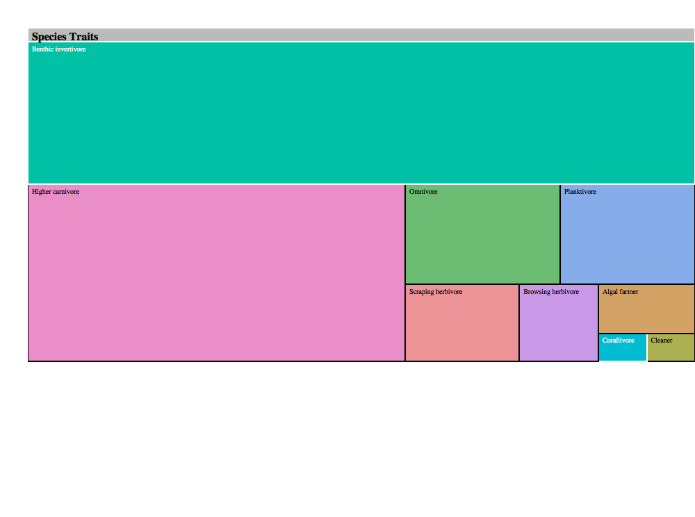

```{r setup, include=F}
library(tidyverse)
library(treemap)
library(d3treeR) # devtools::install_github("timelyportfolio/d3treeR")

# turn off read_csv messages
knitr::opts_chunk$set(warning=F, message=F, echo=F)
```

## Create

- You need a web browser to display htmlwidgets (which rely on HTML, JS, CSS), so you can use Rmarkdown to create [Presentations with ioslides](http://rmarkdown.rstudio.com/ioslides_presentation_format.html).

- Put the rendered `htmlwidgets_save.html` (and `rendered htmlwidgets_save.html`) in a new `docs/` folder, [turn on Github Pages using docs as Source in your repository's Settings](https://github.com/blog/2233-publish-your-project-documentation-with-github-pages) (requires admin privileges), and you'll be able to publicly view it at https://mhepner90.github.io/RVC/htmlwidget_save.html.

## Species Abundances 

```{r pie chart}
psu_common <- psu_family %>%
    group_by(COMNAME) %>%
    summarize(abundance_sum = sum(abundance)) %>%
    filter(abundance_sum != "0") %>% #removes 32 species 
  mutate(com_percent = (abundance_sum/sum(abundance_sum))*100) %>%
  mutate(com_percent=round(com_percent,4))
write_csv(psu_common, "psu_common.csv")

psu_common = read_csv("psu_common.csv")

library(plotly)
abunpie = plot_ly(psu_common, labels=~COMNAME, values =~com_percent, type="pie")

pie = './htmlwidget_abunpie.html'
saveWidget(abunpie, pie)

```

- 293 species accounted for <1% of abundance data

```{r trait visualization}
trait_matrix = read_csv('functional_diversity/species_trait_matrix_316_spp.csv')
trait_matrix_treemap = trait_matrix %>%
  select(Common_name, Maxlength, Trophic_level, Trophic_group, Water_column,Diel_activity,Substrate_type,Complexity, Gregariousness) %>% 
  group_by(Maxlength,
           Trophic_level,
           Trophic_group,
           Water_column,
           Diel_activity,
           Substrate_type,
           Complexity,
           Gregariousness) %>%
  summarise(n = n())%>% 
  ungroup() %>%
  as.data.frame()

treemap2 = 
  d3tree2(
    treemap(
      dtf = trait_matrix_treemap,
      index = c("Trophic_group", "Diel_activity", "Substrate_type", "Trophic_level", "Water_column","Maxlength","Complexity","Gregariousness"),
      vSize = "n", 
      vColor = "Trophic_group",
      type = "index",
      draw = F # turn off ghastly intermediate box plot
      ),
    rootname = "Species Traits")
```

## Species Traits

```{r}
treemap2
```

## Static

```{r htmlwidget to png}
# additional libraries
library(htmlwidgets)
library(webshot)

# paths
htm = './htmlwidget_treemap2.html'
png = './htmlwidget_treemap2.png'

# save widget as html
saveWidget(treemap2, htm)

# save widget as png
webshot(htm, png)
```



You might need to crop and resize image in image editor (eg Preview on Mac) to fit on slide

CSS font styles might clash between standalone html and embedded in presentation, which is fixable with some work
